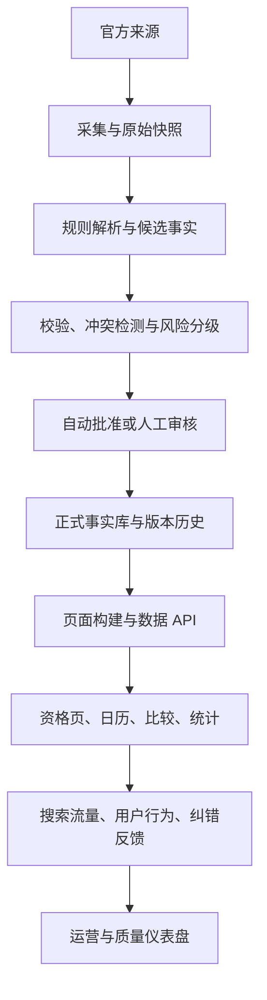
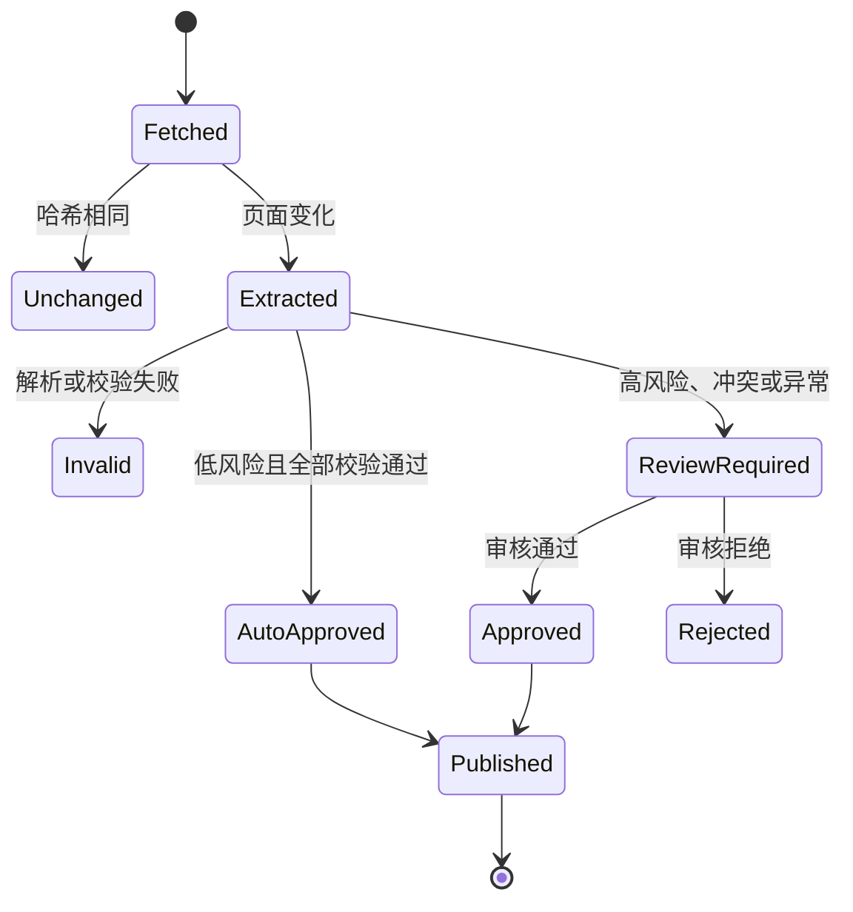

# 日本资格考试数据媒体：完整产品设计方案

> 文档类型：产品设计方案 / 技术需求说明 / 开发验收基线  
> 版本：V1.0  
> 日期：2026-08-11  
> 状态：已确认总体方向，供产品设计与开发实施使用  
> 适用范围：日本市场首发版本

---

## 1. 文档目的

本方案将以下两部分合并为一套完整、可开发、可验收的产品设计：

1. **数据构建端**：从日本官方来源采集资格考试信息，完成原始内容存档、结构化提取、事实校验、变更识别、风险审核、版本管理和自动发布。
2. **用户使用端**：通过资格目录、资格详情、年度日程、报名条件、考试内容、合格率、考试日历、资格比较和官方更新等页面，帮助用户准确、高效地查找和理解资格考试信息。

本方案既是产品设计文档，也是交给 Codex 或开发人员实施时的需求基线。后续若页面视觉、技术栈或首发时间发生变化，不应破坏本文定义的事实可信链、页面职责和风险控制原则。

---

## 2. 产品定位

### 2.1 一句话定位

> 基于日本官方信息，帮助用户查资格、看日程、比条件、跟踪变化的日文资格考试数据媒体。

### 2.2 产品价值

当前资格考试信息通常分散在不同实施机构的网站、公告、表格和 PDF 中，存在以下问题：

- 用户难以快速判断哪个页面是最新年度信息。
- 报名时间、考试时间、费用、报考条件等信息分散。
- 不同资格使用不同术语、页面结构和发布节奏。
- 官方页面可能更新，但用户无法快速知道具体改变了什么。
- 普通内容站经常缺少来源、更新时间和历史记录。
- 比较不同资格时，数据口径不统一。

本产品通过“官方来源结构化 + 用户友好展示”解决上述问题：

- 每个关键事实均可追溯到官方原文。
- 所有引用同一事实的页面同步更新。
- 明确显示目标年度、信息状态和官方确认时间。
- 将复杂的官方说明整理为易懂的日文内容。
- 提供跨资格日历、比较和统计工具。
- 保留变更记录和历史年度信息。

### 2.3 商业与增长优先级

1. **第一优先级：通过高质量数据页面满足 AdSense 审核和长期广告变现条件。**
2. **第二优先级：通过结构化内容、内部链接和稳定更新获得自然搜索流量。**
3. **第三优先级：根据真实用户行为扩展资格类型和数据工具。**

首发阶段不依赖社交媒体增长，不建设需要持续人工运营的社区，也不通过虚构口碑、主观排名或“必过”承诺获取点击。

---

## 3. 核心产品原则

### 3.1 官方事实优先

考试日期、报名时间、费用、报考条件、科目、考试形式、合格标准、合格率等事实，只能来自登记过的官方来源。AI 不得自行补全任何缺失数字或制度信息。

### 3.2 事实与解释分离

系统必须将内容分为三层：

| 内容层         | 生成方式                   |   是否允许 AI 新增事实 |
| -------------- | -------------------------- | ---------------------: |
| 官方事实       | 从已批准的事实数据库读取   |                     否 |
| 编辑部计算     | 固定公式计算，公开计算口径 |                     否 |
| 解释与学习建议 | AI 或模板生成              | 否，只能解释已提供事实 |

### 3.3 例外审核，而非全量人工编辑

系统面向没有日本本地团队、人工资源有限的运营条件设计。普通、低风险、规则明确的数据可自动处理；关键变化、冲突、异常和制度性内容进入审核队列。

### 3.4 一处批准，全站同步

页面不得直接写死日期、费用等动态数据。所有页面统一读取正式事实表。例如：

```text
qualification = takken
exam_year = 2026
fact_key = exam_date
```

当该事实被批准更新后，资格综合页、年度页、考试日历、比较工具和相关专题页必须一起更新。

### 3.5 透明而不伪装

不虚构日本专家、资格持有者、编辑部成员、用户评价或亲身体验。网站通过来源透明、版本可追溯、更新及时和纠错机制建立可信度。

### 3.6 历史可保留，最新不可混用

旧年度数据不能删除，但必须明确标记为历史信息，不得继续显示为当前年度“最新信息”。

---

## 4. 首发范围

### 4.1 首发资格

以最新确认的网站结构为准，首发覆盖以下 6 个资格：

| 序号 | 资格正式名称   | 建议 slug                 | 主要场景                             |
| ---: | -------------- | ------------------------- | ------------------------------------ |
|    1 | 宅地建物取引士 | `takken`                  | 传统年度考试、公告、统计数据         |
|    2 | 行政書士       | `gyoseishoshi`            | 年度考试、报名条件、考试科目         |
|    3 | ITパスポート   | `it-passport`             | CBT、动态公告、持续考试安排          |
|    4 | 基本情報技術者 | `fundamental-it-engineer` | CBT、制度变化、IPA 公告              |
|    5 | 日商簿記       | `bookkeeping`             | 多级别、多次考试、统一考试与网络考试 |
|    6 | FP技能検定     | `fp`                      | 多等级、多实施机构、受検术语差异     |

第二批候选：社会保険労務士、中小企業診断士。只有在首发数据管道稳定、页面正常收录且异常量可控后再扩展。

### 4.2 首发不做

- 登录、个人中心、收藏同步。
- 邮件订阅和推送提醒。
- 课程交易、题库收费、会员系统。
- 用户评论、论坛和问答社区。
- 主观难度星级、年收入排名和“最值得考”榜单。
- 自动生成大量“おすすめ資格10選”文章。
- 海外国家资格数据。
- 未经母语模板校对的大规模 AI 长文生产。

### 4.3 MVP 成功定义

MVP 不是“上线很多文章”，而是完成以下闭环：

> 官方来源 → 自动采集 → 候选事实 → 校验/审核 → 正式事实 → 页面更新 → 用户查找/比较/添加日历 → 数据质量和用户行为监测。

---

## 5. 目标用户与核心任务

### 5.1 用户类型

| 用户类型         | 典型问题                             | 首要入口                 |
| ---------------- | ------------------------------------ | ------------------------ |
| 目标明确的考生   | 今年何时报名、考试、公布成绩？       | 资格年度页               |
| 正在选择资格的人 | 哪个资格适合我？条件有什么不同？     | 资格目录、比较工具       |
| 临近报名用户     | 是否还可以报名？需要准备什么？       | 报名截止页、报名与条件页 |
| 学习规划用户     | 考什么科目、题量、时间、合格率如何？ | 考试内容页、合格率页     |
| 信息核实用户     | 这个数字来自哪里、是否最新？         | 来源展开、更新历史       |
| 多资格备考用户   | 多个考试时间是否冲突？               | 年度考试日历             |

### 5.2 用户核心任务（JTBD）

1. 当我准备参加某项资格考试时，我希望迅速确认当前年度的关键日期，避免错过报名和考试。
2. 当我不确定选择哪项资格时，我希望用统一口径比较报考条件、费用、考试方式和合格率。
3. 当官方信息发生变化时，我希望知道改变了什么，而不是重新阅读整份公告。
4. 当我看到重要数字时，我希望能够查看来源和确认日期，从而判断信息是否可信。
5. 当我规划全年考试时，我希望把考试和报名事件添加到自己的日历，不必注册账户。

---

## 6. 产品总体架构



系统必须形成两条相互隔离的权限链：

```text
采集器只能写入候选区和原始快照区
审核/验证服务才能写入正式事实区
用户页面只能读取正式事实区
AI只能读取已批准事实，不能修改生产事实
```

---

## 7. 用户端信息架构

### 7.1 URL 结构

```text
/
├── shikaku/
│   ├── takken/
│   │   ├── 2026/
│   │   ├── application/
│   │   ├── exam-content/
│   │   └── pass-rate/
│   ├── gyoseishoshi/
│   ├── it-passport/
│   ├── fundamental-it-engineer/
│   ├── bookkeeping/
│   └── fp/
│
├── schedule/
│   ├── 2026/
│   ├── application-deadlines/
│   └── result-dates/
│
├── compare/
├── statistics/
│   ├── pass-rate/
│   └── exam-fees/
│
├── updates/
├── guide/
├── about/
├── editorial-policy/
├── sources/
├── corrections/
├── ai-policy/
├── advertising-policy/
├── privacy/
├── terms/
└── contact/
```

### 7.2 导航

桌面端顶部导航：

| 日文菜单     | 页面                | 作用                     |
| ------------ | ------------------- | ------------------------ |
| 資格を探す   | `/shikaku/`         | 搜索和筛选资格           |
| 試験日程     | `/schedule/{year}/` | 查看报名、考试和合格发表 |
| 比較する     | `/compare/`         | 比较 2～3 个资格         |
| データを見る | `/statistics/`      | 查看合格率和费用         |
| 更新情報     | `/updates/`         | 查看重要官方变化         |
| 搜索图标     | 全站搜索            | 搜索全称、简称和别名     |

移动端底部导航：`探す / 日程 / 比較 / 更新`。

首发不显示登录、注册、会员和消息中心入口。

---

## 8. 用户端页面设计

### 8.1 首页 `/`

首页不是普通文章列表，而是资格信息总入口。

#### 页面模块顺序

1. **首屏定位与搜索**
   - H1：`資格試験の公式情報を、わかりやすく整理。`
   - 说明：`試験日、申込期限、受験料、合格率などを、公式発表に基づいて確認できます。`
   - 资格搜索框。
   - 热门资格快捷入口。
   - `2026年試験日程を見る` 主按钮。

2. **即将发生的重要日期**
   - 申込開始。
   - 申込締切。
   - 試験日。
   - 合格発表。
   - 変更・訂正。
   - 自动计算倒计时，但日期来自正式事实库。

3. **首发资格卡片**
   - 资格名称和简称。
   - 资格类别。
   - 考试方式。
   - 下一次重要事件。
   - 当前状态。
   - 官方确认时间。

4. **跨资格工具**
   - 資格試験カレンダー。
   - 申込締切一覧。
   - 資格比較。
   - 合格率データ。
   - 受験料比較。

5. **最新官方更新**
   - 只展示考试要项、日期、费用、制度、报名条件、延期、停考和订正等真实变化。
   - 普通文章发布不进入此模块。

6. **可信度说明**
   - 说明数据来自考试实施机构和官公厅。
   - 链接到来源、编辑方针、AI 方针和订正入口。

#### 首页规则

- 首页显示的倒计时必须考虑日本标准时间（JST）。
- 没有确切日期时不得生成倒计时。
- `公式発表待ち` 状态不显示伪精确日期。
- 首屏重要操作区域不放广告。

### 8.2 资格目录 `/shikaku/`

#### 筛选字段

- 分野：法律、会计、金融、IT、商务。
- 资格类别：国家资格、公的资格、民间资格。
- 考试频率：年 1 回、年多次、CBT。
- 是否存在报考条件。
- 费用区间。
- 考试月份。
- 当前是否开放报名。
- 当前年度日程是否公布。

#### 搜索别名

```text
宅建 → 宅地建物取引士
FE → 基本情報技術者
ITパス → ITパスポート
簿記 → 日商簿記
FP → ファイナンシャル・プランニング技能検定
```

#### SEO 规则

- 用户筛选生成的参数 URL 默认 `noindex,follow`。
- 只有具备独立说明和稳定需求的分类组合才生成静态可索引页。
- 排序、分页和筛选参数必须设置 canonical，避免大量重复抓取。

### 8.3 资格综合页 `/shikaku/{slug}/`

页面职责：回答“这是什么资格、当前年度最重要的信息是什么、还可以去哪里查看详情”。

#### 首屏快速事实卡

| 字段                   | 数据来源           |
| ---------------------- | ------------------ |
| 申込期間               | 已批准年度事件事实 |
| 試験日                 | 已批准年度事件事实 |
| 合格発表               | 已批准年度事件事实 |
| 受験手数料／受検手数料 | 已批准费用事实     |
| 受験資格／受検資格     | 已批准条件事实     |
| 試験方式               | 已批准考试规格事实 |
| 情報状態               | 系统状态计算       |
| 公式情報確認日         | 来源检查记录       |

#### 主体顺序

1. 资格是什么。
2. 当前年度重要日程摘要。
3. 报考资格和申请方式。
4. 考试科目、题量、时间和形式。
5. 历年合格率图表。
6. 费用和考试频率。
7. 可比较的相关资格。
8. 最新官方变化。
9. 官方来源。
10. 页面更新历史。
11. 相关页面。

### 8.4 年度考试页 `/shikaku/{slug}/{year}/`

标题模板：

```text
{year}年{qualification_name}試験の日程・申込期間・合格発表
```

页面包含：

- 年度信息状态。
- 报名开始和截止。
- 缴费期限。
- 准考证、受验票或确认书相关日期。
- 考试日期和时间。
- 合格发表日期。
- 灾害、延期、订正和会场变化。
- 单事件和全年 ICS 下载。
- 官方考试要项、公告和 PDF。
- 来源确认日期和更新历史。

尚未发布的新年度不得生成只有“未公布”内容的薄页面。新年度只有达到“至少存在一项官方年度事实 + 页面具备有效说明”的条件后才发布。

### 8.5 报名与条件页 `/shikaku/{slug}/application/`

页面包含：

- 官方报考资格原意。
- 编辑部通俗解释。
- 网络、邮寄或现场申请方式。
- 所需材料。
- 支付方式。
- 申请步骤。
- 常见遗漏事项。
- 当前年度报名入口和官方链接。
- 与上一年度相比的变化提示。

必须保留官方术语，不得将所有考试的“受験/受検”“申込み/受検申請”等表达强行统一。

### 8.6 考试内容页 `/shikaku/{slug}/exam-content/`

页面包含：

- 考试科目。
- 各科题量。
- 考试时间。
- 出题形式。
- 评分方法。
- 合格标准。
- 科目免除或部分免除。
- 官方大纲、公开问题和样题链接。
- 制度变更历史。

不得自动生成没有官方或明确方法论支撑的“难度评分”。

### 8.7 合格率页 `/shikaku/{slug}/pass-rate/`

页面包含：

- 年度。
- 报名人数。
- 实际受考人数。
- 合格人数。
- 合格率。
- 合格点或基准。
- 统计口径说明。
- 历年趋势图。
- CSV 下载（可选，第二阶段实现）。
- 每一年度的数据来源。

合格率只能按确定的分母计算：

```text
合格率 = 合格人数 ÷ 实际受考人数 × 100%
```

如果官方使用其他口径，应保存并展示官方口径，不能自行替换。页面必须说明“历史合格率不等于个人通过概率”。

### 8.8 考试日历 `/schedule/{year}/`

提供三种视图：

- 月历视图。
- 时间线视图。
- 表格视图。

事件类型：

| 类型     | 日文标签 | 颜色语义 |
| -------- | -------- | -------- |
| 报名开始 | 申込開始 | 信息色   |
| 报名截止 | 申込締切 | 警示色   |
| 考试     | 試験日   | 主色     |
| 结果     | 合格発表 | 成功色   |
| 变更     | 日程変更 | 高风险色 |
| 暂停     | 実施休止 | 高风险色 |

功能：

- 按资格筛选。
- 按事件类型筛选。
- 查看来源和确认时间。
- 下载单个事件 ICS。
- 下载某资格全年 ICS。
- 跳转资格年度页。

ICS 不要求登录或填写邮箱。发生已批准的日期变更时，重新下载生成的新 ICS 必须包含稳定 UID 和更新后的 `SEQUENCE`。

### 8.9 资格比较 `/compare/`

允许选择 2～3 个资格，比较：

- 资格性质。
- 实施机构。
- 报考条件。
- 费用。
- 考试频率。
- 考试方式。
- 科目数量。
- 考试时间。
- 历年合格率。
- 下一次报名截止。
- 下一次考试日期。

每个动态数字可以展开查看来源、适用年度和官方确认日期。

首发静态比较页：

- 宅建と行政書士の違い。
- ITパスポートと基本情報技術者の違い。
- 日商簿記とFP技能検定の違い。

静态比较页负责解释选择维度；动态比较器负责展示数据。系统不得只根据合格率给出“更容易”或“更值得考”的绝对结论。

### 8.10 官方更新中心 `/updates/`

更新中心是“事实变化日志”，不是普通新闻栏目。

更新类型：

- 試験要項公開。
- 年度日程発表。
- 受験料変更。
- 制度変更。
- 受験資格変更。
- 訂正。
- 延期・中止・休止。
- 合格データ公開。

独立更新页至少展示：

```text
发生日期
受影响资格
影响字段
旧值
新值
官方原文摘要
官方来源
本站反映时间（JST）
相关页面
```

导航、版权年份、CSS 和无事实影响的页面改动不能生成更新内容。

### 8.11 指南与可信度页面

首发指南：

1. 資格試験情報の正しい確認方法。
2. 資格試験の年間スケジュールの立て方。
3. 受験申込み前の確認チェックリスト。
4. 合格率データを見るときの注意点。

必备可信度和合规页面：

- 运营者信息。
- 编辑方针。
- 信息来源说明。
- AI 使用方针。
- 广告与 PR 方针。
- 订正申请。
- 隐私政策。
- 使用条款。
- 联系方式。

---

## 9. 全站状态与日期定义

### 9.1 用户可见状态

| 状态代码                  | 日文显示       | 说明                       |
| ------------------------- | -------------- | -------------------------- |
| `verified`                | 公式確認済み   | 已从正式官方来源确认       |
| `partially_announced`     | 一部発表済み   | 当前年度只有部分信息已发布 |
| `awaiting_official`       | 公式発表待ち   | 官方尚未公布               |
| `previous_year_reference` | 前年度情報     | 仅提供上一年度参考         |
| `changed_or_corrected`    | 変更・訂正あり | 官方已发布重要变化         |
| `application_open`        | 申込受付中     | 当前可报名                 |
| `application_closed`      | 受付終了       | 报名已结束                 |
| `completed`               | 実施済み       | 考试已经结束               |
| `suspended`               | 実施休止       | 官方宣布暂停               |
| `under_review`            | 公式情報確認中 | 检测到异常，尚未批准发布   |

### 9.2 三类日期

| 字段                   | 定义                 | 更新条件         |
| ---------------------- | -------------------- | ---------------- |
| `published_at`         | 本站页面首次发布     | 仅首次发布       |
| `updated_at`           | 页面可见内容最后变化 | 页面内容真正变化 |
| `official_verified_at` | 最后检查官方来源时间 | 来源检查成功后   |

采集器运行但没有事实变化时，只更新内部检查记录和 `official_verified_at`，不得伪造页面内容更新。

---

## 10. 数据来源体系

### 10.1 来源登记

每个来源必须先登记，再允许采集。来源记录至少包含：

```text
source_id
qualification_id
organization_id
official_domain
source_url
source_type
content_scope
expected_update_cycle
parser_adapter
risk_default
is_active
created_at
```

允许的来源优先级：

1. 日本政府、官公厅和法令数据库。
2. 考试实施机构官网。
3. 实施机构正式 PDF、公告、统计表和 API。
4. 明确由实施机构维护的关联站点。

新闻媒体、培训机构、个人博客和聚合站可以用于发现线索，但不得作为关键事实的最终来源。

### 10.2 来源类型与采集频率

| 来源类型   | 处理方式                 |   普通时期 |   报名/考试期 |
| ---------- | ------------------------ | ---------: | ------------: |
| 官方 API   | 保存 JSON/XML 后解析     |       每天 | 每 6～12 小时 |
| 官方 HTML  | 固定选择器提取           |       每周 |          每天 |
| HTML 表格  | 表格解析                 |       每周 |          每天 |
| 文字型 PDF | 文本和表格提取           | 新文件触发 |    新文件触发 |
| 扫描 PDF   | OCR，仅生成待审核候选    | 新文件触发 |    新文件触发 |
| 官方新闻页 | 标题、日期、链接、关键词 |       每天 |     每 6 小时 |
| RSS        | RSS 订阅                 |  每 6 小时 | 每小时～6小时 |
| 官方链接   | 状态和重定向检查         |       每周 |          每天 |

### 10.3 原始快照

每次抓取必须保存：

```text
原始 URL
HTTP 状态码
最终 URL
抓取时间（JST 与 UTC）
页面标题
原始 HTML / JSON / XML / PDF
内容哈希
ETag
Last-Modified
响应头摘要
文本化版本
采集器版本
```

快照存入对象存储，数据库保存元数据和对象地址。原始内容采用不可变版本，不覆盖历史快照。

### 10.4 独立适配器

不同机构必须使用独立适配器，不依赖一个通用 AI 爬虫：

```text
retio_schedule_parser
gyosei_guide_parser
ipa_cbt_notice_parser
jcci_calendar_parser
jafp_schedule_parser
```

每个适配器需要：

- 来源 URL 和允许域名。
- 选择器或表格定位规则。
- 年度识别规则。
- 日文日期解析规则。
- 官方术语映射。
- 字段校验规则。
- 单元测试样本。
- 结构异常时的失败策略。

适配器失败不得自动退化为“AI 猜测”。可以调用 AI 辅助定位候选文本，但候选结果必须通过规则校验，并根据风险等级决定是否审核。

---

## 11. 数据模型

推荐使用 PostgreSQL，采用“业务结构表 + 通用事实版本表”的混合设计。

### 11.1 核心主数据

| 表                            | 关键字段                                                     | 作用                    |
| ----------------------------- | ------------------------------------------------------------ | ----------------------- |
| `qualifications`              | id, slug, official_name, short_name, category, field, active | 资格主表                |
| `qualification_aliases`       | qualification_id, alias, locale                              | 搜索别名                |
| `organizations`               | name, official_name, domain, type                            | 实施机构                |
| `qualification_organizations` | qualification_id, organization_id, role                      | 资格与机构关系          |
| `exam_levels`                 | qualification_id, code, name, sort_order                     | 级别，如簿记、FP 各等级 |
| `sources`                     | URL、类型、适配器、频率、风险                                | 官方来源登记            |
| `source_snapshots`            | source_id, hash, fetched_at, object_key                      | 原始快照                |

### 11.2 候选与正式事实

| 表                 | 关键字段                                          | 作用         |
| ------------------ | ------------------------------------------------- | ------------ |
| `candidate_facts`  | entity, year, fact_key, value, source_snapshot_id | 新提取候选   |
| `fact_validations` | candidate_id, rule, result, message               | 校验明细     |
| `fact_conflicts`   | candidate_id, conflicting_fact_id, status         | 来源冲突     |
| `review_tasks`     | risk, old_value, new_value, context, decision     | 异常审核     |
| `facts`            | entity, year, fact_key, current_revision_id       | 当前正式事实 |
| `fact_revisions`   | value, source_id, snapshot_id, valid_from/to      | 事实版本历史 |
| `change_events`    | field, old_revision, new_revision, impact         | 对外变更记录 |

### 11.3 领域结构表

为了查询效率和数据约束，以下数据同时维护结构化领域表：

| 表                  | 示例字段                                                  |
| ------------------- | --------------------------------------------------------- |
| `exam_events`       | event_type, start_at, end_at, timezone, year, level       |
| `exam_fees`         | amount, currency, tax_status, payment_method, year, level |
| `eligibility_rules` | rule_type, official_text, normalized_summary, year        |
| `exam_specs`        | method, duration_minutes, question_count, scoring         |
| `exam_subjects`     | name, question_count, weight, exemption                   |
| `annual_statistics` | applicants, examinees, passed, pass_rate, pass_mark       |
| `official_notices`  | notice_type, published_at, title, source_id, severity     |

领域表的每一条记录必须保存 `fact_revision_id` 或等价来源指针，确保用户页面中的每个数字都可回溯。

### 11.4 事实记录必填字段

```json
{
  "qualification": "takken",
  "exam_year": 2026,
  "fact_key": "exam_date",
  "value": "2026-10-18",
  "value_type": "date",
  "source_id": "official-source-id",
  "source_snapshot_id": "snapshot-id",
  "official_published_at": null,
  "retrieved_at": "2026-08-11T09:00:00+09:00",
  "verified_at": "2026-08-11T09:05:00+09:00",
  "verification_status": "verified",
  "risk_level": "high",
  "valid_from": "2026-08-11T09:05:00+09:00",
  "valid_to": null
}
```

以上数值仅表示数据结构示例，不能直接作为真实考试信息写入生产环境。

---

## 12. 采集、验证与发布流程

### 12.1 状态机



### 12.2 两级变化识别

第一级：页面变化。

```text
新旧哈希相同 → 记录检查成功 → 结束
新旧哈希不同 → 进入字段提取
```

第二级：事实变化。

```text
页面变、事实不变 → 不更新用户正文
事实变、通过校验 → 进入风险判断
事实冲突或异常 → 进入审核队列
```

### 12.3 高风险关键词

```text
変更 / 延期 / 中止 / 休止 / 訂正 / 追加 / 再開
受験料改定 / 試験制度 / 経過措置 / 災害 / 会場変更
```

新闻和公告采集器必须扫描这些关键词，但关键词命中只用于提高风险等级，不可直接据此更改正式事实。

### 12.4 自动校验

每个候选事实至少执行：

- 官方域名白名单校验。
- HTTP 状态和最终 URL 校验。
- 年度校验。
- 日期格式和星期对应校验。
- 开始时间早于截止时间校验。
- 报名截止早于考试日的合理性校验。
- 金额格式、币种和范围校验。
- 与上一年度差异阈值校验。
- 页面中同一字段多处一致性校验。
- 多官方来源冲突校验。
- 规则解析与 AI 辅助解析一致性校验。
- OCR 来源标记。
- 来源快照存在性校验。

### 12.5 风险分级

| 等级 | 示例                                                   | 发布策略                 |
| ---- | ------------------------------------------------------ | ------------------------ |
| 低   | 官方页面标题、来源链接、已存在事实的确认时间           | 校验通过可自动批准       |
| 中   | 普通说明、非关键公告分类、低影响文本变化               | 规则充分时自动，否则审核 |
| 高   | 考试日、截止日、费用、条件、科目、合格标准、延期、停考 | 必须审核                 |
| 严重 | 多来源冲突、疑似制度变化、官方 404、异常大幅变化       | 阻断发布并立即通知       |

### 12.6 审核界面

审核任务只展示决策所需信息：

```text
资格：宅地建物取引士
字段：試験日
适用年度：2026
旧值：……
新值：……
变化比例/类型：日期变化
来源：官方页面
原文片段：……
中文辅助翻译：……
其他来源：一致 / 冲突 / 无
操作：批准 / 拒绝 / 延后 / 标记官方确认中
```

批准操作必须记录审核人、时间和说明。不得直接修改旧版本；新值应创建新的事实修订版本。

### 12.7 发布原子性

一次事实批准与相关页面刷新必须具备事务性：

1. 写入新事实版本。
2. 关闭旧版本有效期。
3. 创建变更事件。
4. 计算受影响页面。
5. 触发页面重建或缓存失效。
6. 构建成功后切换公开版本。
7. 构建失败则保留上一公开版本并告警。

用户不能看到部分页面已经更新、其他页面仍保留旧值的中间状态。

---

## 13. 数据有效期与更新策略

### 13.1 有效期

| 数据类型      |             重新确认周期 | 过期处理               |
| ------------- | -----------------------: | ---------------------- |
| 考试日期      | 本考试年度结束前持续确认 | 年度结束后转历史       |
| 报名日期      |           报名期每天检查 | 截止后转历史事件       |
| 考试费用      |                    90 天 | 标记待确认，不直接删除 |
| 报考资格      |                   180 天 | 标记待确认             |
| 考试科目/形式 | 新年度要项发布后立即复核 | 旧版保留历史           |
| 合格率        |       结果发布期每天检查 | 新年度发布后追加       |
| 官方链接      |                     7 天 | 失效则告警             |
| 紧急公告      |               6～24 小时 | 高风险命中立即审核     |

### 13.2 数据陈旧状态

事实超过有效期后：

- 不自动删除。
- 不继续显示为“公式確認済み”。
- 转为 `要再確認` 内部状态。
- 相关页面可以继续显示上一次确认值，但必须显示确认日期；高风险字段根据配置显示 `公式情報確認中`。
- 创建检查任务并通知。

---

## 14. AI 使用边界与日文质量

### 14.1 AI 可以做

- 将已批准的结构化事实整理为易读说明。
- 对官方长句进行通俗解释。
- 生成页面摘要、标题候选和内部链接建议。
- 对比旧值和新值并生成变更摘要草稿。
- 辅助检测日文语法、术语和前后不一致。
- 为审核者提供中文辅助翻译。

### 14.2 AI 不可以做

- 直接写入正式事实表。
- 补充提示词中没有提供的数字、日期、费用和制度。
- 根据上一年度推测下一年度日期。
- 虚构参加经历、使用体验、考生评价或专家意见。
- 将“尚未公布”改写成可能被误解为已确定的信息。
- 独立判断法律、资格条件或制度解释并自动发布。

### 14.3 基础提示词约束

```text
只能使用输入中提供的已验证结构化事实。
不得补充未提供的考试日期、费用、合格率、资格条件或制度信息。
不得声称亲自参加、使用或体验过。
不得虚构日本考生评价、专家审核或资格持有者意见。
所有数字必须保留适用年度和来源标识。
无法确认的信息写为「公式発表をご確認ください」。
输出内容不得改变事实值。
```

### 14.4 日文术语表

| 概念     | 标准日文示例           | 规则             |
| -------- | ---------------------- | ---------------- |
| 报名     | 受験申込み／受検申請   | 跟随实施机构用语 |
| 考试费用 | 受験手数料／受検手数料 | 不同资格不得混用 |
| 考生     | 受験者／受検者         | 跟随官方名称     |
| 考试大纲 | 試験要綱／試験案内     | 保留官方术语     |
| 合格率   | 合格率                 | 必须附年度和口径 |

术语表需要按资格和机构建立覆盖规则，不能只维护一张全局替换表。

### 14.5 自动日文质检

- 助词和语法。
- 简体、敬体是否混用。
- 正式机构名称。
- `受験/受検` 等术语。
- 西历与和历换算。
- 日期与星期对应。
- 年度前后一致。
- 金额和税务说明。
- 页面内数值一致。
- 官方链接有效。
- 无来源数字检测。
- 页面重复度检测。
- 夸大和保证性表达检测。

### 14.6 母语质量控制

最低成本方案：

1. 首批完成约 10 种固定页面模板。
2. 对模板进行一次日语母语校对。
3. 将修改结果沉淀到术语表、禁用表达和写作规范。
4. 后续内容通过模板和自动质检生成。
5. 每季度抽查约 10 个页面，重点检查自然度和术语。

母语校对用于提高表达自然度，不能替代官方事实核验。

---

## 15. 数据与页面映射

| 正式数据                      | 自动更新页面                                     |
| ----------------------------- | ------------------------------------------------ |
| `exam_date`                   | 资格综合页、年度页、日历、比较工具、首页日期模块 |
| `application_start/end`       | 综合页、年度页、截止列表、日历、首页             |
| `result_date`                 | 年度页、合格发表列表、日历                       |
| `exam_fee`                    | 综合页、年度页、费用比较、比较工具               |
| `eligibility`                 | 综合页、报名页、比较工具                         |
| `exam_subjects`               | 考试内容页、比较工具                             |
| `applicants/examinees/passed` | 合格率页、全站统计页                             |
| `pass_mark`                   | 考试内容页、合格率页                             |
| `official_notice`             | 页面警告栏、更新中心                             |
| `suspension/correction`       | 首页高风险提醒、资格页、年度页、更新中心         |

系统必须维护“事实 → 页面”的依赖索引。发布服务不能靠人工填写受影响页面列表。

---

## 16. 数据 API 与前端契约

用户页面只读取公开 API 或构建时数据层，不直接访问采集表。

### 16.1 建议接口

```text
GET /api/v1/qualifications
GET /api/v1/qualifications/{slug}
GET /api/v1/qualifications/{slug}/years/{year}
GET /api/v1/qualifications/{slug}/application
GET /api/v1/qualifications/{slug}/exam-content
GET /api/v1/qualifications/{slug}/statistics
GET /api/v1/calendar?year=&qualification=&event_type=
GET /api/v1/compare?qualifications=a,b,c
GET /api/v1/updates?qualification=&type=&page=
GET /api/v1/sources/{public_source_id}
GET /api/v1/ics/{qualification}/{year}
```

### 16.2 响应规则

每个动态事实对象至少返回：

```json
{
  "key": "exam_date",
  "value": "2026-10-18",
  "display_value": "2026年10月18日（日）",
  "year": 2026,
  "status": "verified",
  "official_verified_at": "2026-08-11T09:05:00+09:00",
  "source": {
    "organization_name": "公式実施機関",
    "public_url": "https://official.example.jp/..."
  }
}
```

示例中的 URL 和数值是接口格式占位符。

### 16.3 禁止返回

- 内部对象存储地址。
- 原始审核者个人信息。
- 内部备注和安全信息。
- 尚未批准的候选事实。
- 采集器异常堆栈。

---

## 17. 管理后台

### 17.1 模块

| 模块       | 主要功能                                 |
| ---------- | ---------------------------------------- |
| 仪表盘     | 数据新鲜度、异常数、采集成功率、页面状态 |
| 资格管理   | 资格、级别、别名、分类和显示顺序         |
| 来源管理   | 官方来源、域名、适配器、频率和风险       |
| 采集任务   | 最近运行、耗时、HTTP 状态、快照和错误    |
| 候选事实   | 新旧值、提取位置、校验结果               |
| 审核队列   | 批准、拒绝、延后、官方确认中             |
| 冲突中心   | 多来源不一致和年度混用                   |
| 变更日志   | 已发布变更和受影响页面                   |
| 页面状态   | 构建结果、索引状态、更新时间             |
| 术语与模板 | 资格术语、禁用表达、内容模板             |
| 纠错反馈   | 用户提交、处理状态和结果                 |

### 17.2 权限

首发至少定义：

- `admin`：系统配置、来源和用户管理。
- `reviewer`：审核高风险事实和内容。
- `operator`：查看任务、重跑采集、处理普通异常。
- `viewer`：只读仪表盘。

即使实际只有一名运营者，也应保留权限边界，避免采集服务拥有管理员权限。

### 17.3 手工覆盖

允许管理员在官方页面结构异常时录入候选事实，但必须：

- 选择官方来源。
- 附原文片段和快照。
- 填写适用年度。
- 经过与同风险级别相同的审核。
- 设置下一次复核日期。

不允许直接在前端 CMS 文本中修改动态事实。

---

## 18. SEO 设计

### 18.1 搜索意图与页面职责

| 页面                    | 主要搜索意图         |
| ----------------------- | -------------------- |
| `/shikaku/takken/`      | 宅建是什么、综合信息 |
| `/shikaku/takken/2026/` | 宅建 2026 日程       |
| `/application/`         | 报考条件、报名方法   |
| `/exam-content/`        | 科目、题量、考试形式 |
| `/pass-rate/`           | 历年合格率、合格点   |
| `/schedule/2026/`       | 2026 资格考试日历    |
| `/compare/`             | 多资格比较           |
| `/updates/`             | 官方信息变化         |

不要为同一资格分别生成内容高度重合的“考试日”“报名日”“合格发表日”薄页面，这些内容集中到年度页。

### 18.2 技术 SEO

- 稳定、可读、层级清晰的 URL。
- 每页唯一 title、description 和 H1。
- canonical 指向标准 URL。
- 参数筛选页 `noindex,follow`。
- 按页面类型生成 XML Sitemap。
- Sitemap 只放可索引、返回 200 的正式页面。
- 删除页返回 410 或正确 404，不软 404。
- 年度切换保留历史页。
- 日文站首发使用 `lang="ja"`。
- 未上线其他国家/语言前不伪造 hreflang。
- 面包屑与页面层级一致。
- 官方来源外链使用清晰锚文本。
- 页面更新日只在内容变化时更新。

### 18.3 结构化数据

| 页面                         | 建议类型         |
| ---------------------------- | ---------------- |
| 首页/运营者页                | `Organization`   |
| 全部层级页                   | `BreadcrumbList` |
| 指南和重要更新               | `Article`        |
| 有下载数据和方法说明的统计页 | `Dataset`        |

首发不使用虚构的 `Review`、`AggregateRating`、`Product` 和无对应可见内容的 FAQ 标记。

### 18.4 内链

每个详情页至少包含：

- 1 个上级页链接。
- 2～4 个同资格子页链接。
- 1～2 个跨资格数据工具链接。
- 1～3 个真正相关的比较或指南链接。

核心链路：

```text
首页 → 资格目录 → 资格综合页
资格综合页 → 年度 / 报名 / 考试内容 / 合格率
资格详情 → 日历 / 比较 / 统计
更新页 → 受影响的资格和年度页
```

---

## 19. AdSense 与广告体验

### 19.1 原则

- 广告不能伪装成官方入口、下载按钮或站内导航。
- 重要日期、报名操作和官方链接附近不放广告。
- 不为增加广告展示而拆分页面或制造无价值分页。
- 广告不覆盖正文、筛选器、比较器和日历操作。
- 广告、PR 和联盟关系应在对应内容附近明确标识。

### 19.2 建议广告位

1. 第一段完整正文之后。
2. 页面中部两个自然模块之间。
3. 相关页面入口之前。
4. 桌面端侧栏可进行受控测试。
5. 首页最多 1～2 个广告位。

### 19.3 自动广告排除区域

- 顶部和底部导航。
- 资格搜索框。
- 快速事实卡。
- 日期和倒计时卡。
- ICS 下载按钮。
- 官方网站按钮。
- 比较器选择区域。
- 纠错提交区域。

### 19.4 审核前准备

- 网站具备完整运营者、隐私、条款、联系和广告方针页面。
- 首发页面不是空模板或仅有少量重复文本。
- 导航、移动端、404 和站内链接正常。
- 无虚构作者和评论。
- 广告代码错误不会阻塞主要内容。
- 根据用户所在地和实际广告配置落实适用的同意管理要求。

---

## 20. 用户行为数据与产品指标

### 20.1 埋点事件

| 事件                   | 关键参数                        |
| ---------------------- | ------------------------------- |
| `qualification_search` | query, result_count             |
| `qualification_select` | qualification, source_page      |
| `schedule_filter`      | year, qualification, event_type |
| `calendar_add`         | qualification, event_type, year |
| `compare_start`        | selected_count                  |
| `compare_view`         | qualifications                  |
| `source_expand`        | fact_key, qualification         |
| `official_link_click`  | source_id, fact_key             |
| `update_view`          | qualification, update_type      |
| `correction_submit`    | page_type, issue_type           |
| `internal_link_click`  | from_page, to_page, module      |

不采集用户在搜索框中可能输入的敏感个人信息；搜索日志需要设置保留周期和脱敏规则。

### 20.2 产品指标

| 维度 | 指标                                       |
| ---- | ------------------------------------------ |
| 获取 | 自然搜索点击、有效收录页、品牌/非品牌流量  |
| 使用 | 搜索成功率、日历筛选、比较完成、ICS 下载   |
| 深度 | 每次访问页面数、详情到工具的点击率         |
| 信任 | 来源展开率、官方链接点击率、纠错率         |
| 留存 | 7/30 天回访、报名期回访                    |
| 商业 | 广告可见率、页面 RPM、广告对核心操作的影响 |

### 20.3 数据质量指标

| 指标                       |      目标 |
| -------------------------- | --------: |
| 关键事实拥有官方来源比例   |      100% |
| 已发布高风险字段未验证数量 |         0 |
| 来源检查按时完成率         |      ≥98% |
| 过期事实比例               |       <1% |
| 官方失效链接               |         0 |
| 未处理数据冲突             |         0 |
| 自动提取成功率             |      ≥95% |
| 日期与星期错误             |         0 |
| 无来源数字                 |         0 |
| 高风险异常处理时间         | 24 小时内 |

核心指标不是文章数量，而是“多少用户需要的事实能够准确、及时且可追溯地提供”。

---

## 21. 非功能需求

### 21.1 性能

- 公开内容优先静态生成或增量静态更新。
- 目标 LCP ≤ 2.5 秒、INP < 200 毫秒、CLS < 0.1。
- 图片使用现代格式并声明尺寸。
- 字体减少阻塞和不必要字重。
- 日历和比较器按需加载。
- 广告脚本不得阻塞核心内容渲染。

### 21.2 可访问性

- 键盘可操作导航、筛选和比较器。
- 颜色状态同时提供文字标签。
- 图表提供数据表或文字摘要。
- 表单具有 label、错误说明和焦点反馈。
- 日期不只依赖颜色表达。
- 日文页面设置正确语言属性。

### 21.3 安全

- 采集器不执行来源页面脚本，动态页面仅在隔离环境使用浏览器自动化。
- 官方域名白名单和重定向目标校验，防止 SSRF。
- 上传/下载 PDF 设置大小、类型和恶意文件检查。
- 管理后台启用强认证和操作日志。
- 生产密钥使用环境变量或密钥服务，不进入仓库。
- API 限速，纠错表单增加反滥用保护。
- 数据库最小权限：采集、审核、公开读取使用不同账户。

### 21.4 隐私

- 首发不要求用户注册。
- ICS 直接下载，不收集邮箱。
- 联系和纠错表单只收集必要信息。
- 分析工具实施 IP 和保留期配置。
- 隐私政策说明统计、广告、Cookie 和第三方服务。

### 21.5 可恢复性

- PostgreSQL 每日备份，并定期验证恢复。
- 原始快照和数据库备份分开保存。
- 正式事实采用版本历史，不做原地覆盖。
- 页面构建保留上一可用版本。
- 高风险错误支持按事实版本回滚，并自动重建受影响页面。

---

## 22. 推荐技术架构

### 22.1 技术选型

| 模块      | 推荐方案                                |
| --------- | --------------------------------------- |
| 前端      | Next.js + TypeScript，静态生成/增量更新 |
| UI        | 自建轻量组件库 + 设计 Token             |
| 数据库    | PostgreSQL                              |
| ORM       | Prisma 或 Drizzle，项目内统一一种       |
| 原始快照  | S3 兼容对象存储                         |
| 数据采集  | Python                                  |
| HTML 解析 | BeautifulSoup / lxml                    |
| 动态页面  | Playwright，仅作为后备                  |
| PDF 提取  | PyMuPDF / pdfplumber                    |
| OCR       | 只生成待审核结果                        |
| 调度      | 云端 Cron / 作业队列                    |
| 管理后台  | 与主站同仓或独立受保护应用              |
| 通知      | 飞书机器人或邮件                        |
| 监控      | 错误监控 + 结构化日志 + 指标告警        |

实际依赖应采用开发时稳定且仍受支持的版本，并锁定版本；本方案不写死具体小版本号。

### 22.2 服务边界

```text
apps/web                 用户网站
apps/admin               管理后台
services/api             公开与后台 API
services/collector       采集调度和下载
services/parser          资格适配器和提取
services/validator       校验、冲突与风险判断
services/publisher       正式事实发布和页面刷新
packages/schema          共享类型和数据契约
packages/ui              前端组件
packages/content-rules   术语、模板、禁用表达
```

如果首发由个人开发，可在同一代码仓中采用模块化单体部署，但数据库权限和业务模块边界仍应保持清晰。

### 22.3 环境

- `local`：开发和适配器样本测试。
- `staging`：使用生产结构、独立数据，验证采集和页面。
- `production`：正式公开环境。

禁止开发和测试采集器直接写入生产正式事实表。

---

## 23. 监控与告警

### 23.1 告警级别

| 级别 | 场景                               | 通知策略            |
| ---- | ---------------------------------- | ------------------- |
| P0   | 错误事实已公开、全站不可用         | 立即通知            |
| P1   | 高风险变化、来源冲突、主要来源 404 | 立即通知            |
| P2   | 适配器连续失败、数据即将过期       | 当日汇总 + 阈值通知 |
| P3   | 普通页面构建失败、低风险链接异常   | 每日汇总            |

### 23.2 必监控项目

- 采集任务成功率和持续时间。
- 页面哈希变化率。
- 字段提取成功率。
- 高风险关键词命中。
- 候选事实数量和审核积压。
- 数据有效期。
- 官方链接状态。
- 页面构建和缓存刷新结果。
- API 错误率和延迟。
- 404、软 404 和重定向链。
- Sitemap 生成状态。
- 用户纠错提交。

---

## 24. 测试方案

### 24.1 采集器测试

- 每个适配器保存至少 3 类固定样本：正常、结构变化、字段缺失。
- 使用历史快照做回归测试，不只测试当前在线页面。
- 验证编码、日文全角数字、和历、西历、跨年日期。
- PDF 表格、换页和 OCR 结果分别测试。

### 24.2 数据规则测试

- 日期与星期一致。
- 年度不混用。
- 时间范围合法。
- 金额范围和类型合法。
- 合格率公式和四舍五入规则。
- 同一事实多来源一致/冲突。
- 高风险事实不能自动发布。
- 未绑定快照的事实不能批准。

### 24.3 页面测试

- 每种页面有数据、部分数据、无数据、过期数据和变更状态。
- 移动端、平板、桌面端。
- 日文长文本不会破坏布局。
- 表格在小屏可阅读。
- 来源展开和官方链接正确。
- 动态事实在所有引用页面一致。
- 广告脚本失败时主内容仍可使用。

### 24.4 SEO 测试

- title、description、H1 唯一。
- canonical 正确。
- noindex 筛选页不进入 Sitemap。
- 结构化数据与可见内容一致。
- 404/410 正确。
- 年度历史页可访问。
- 内链无孤立核心页。

### 24.5 发布前端到端测试

必须通过以下场景：

1. 模拟官方考试日期变化。
2. 生成候选事实并判定高风险。
3. 审核界面显示新旧值和原文。
4. 批准后生成新事实版本。
5. 资格页、年度页、首页、日历和比较页全部同步。
6. 更新中心生成一条有效变更记录。
7. 构建失败时用户仍看到上一正确版本。
8. 回滚事实后所有受影响页面恢复一致。

---

## 25. 首发页面规模

以 6 个资格上线时，目标约 52 页：

| 页面组                                               | 数量 |
| ---------------------------------------------------- | ---: |
| 首页                                                 |    1 |
| 资格目录                                             |    1 |
| 每资格 5 页 × 6                                      |   30 |
| 日历、截止、结果、比较、费用、统计、更新             |    7 |
| 通用指南                                             |    4 |
| 运营者、来源、编辑、AI、广告、订正、隐私、条款、联系 |    9 |
| 合计                                                 |   52 |

实际页面数以有效内容为准。没有足够已验证数据的页面不应为了达到数量而发布。

---

## 26. 分阶段实施计划

### 阶段 0：项目基础与规则冻结

#### 目标

建立统一代码、数据和产品规范，避免前后端并行开发时出现字段不一致。

#### 工作内容

- 建立仓库和环境。
- 确认 6 个资格主数据和别名。
- 建立数据字典、状态枚举和风险矩阵。
- 建立官方来源登记表。
- 完成基础日文术语表。
- 确认页面线框和设计 Token。

#### 验收

- 数据字段、状态和 URL 不再由各模块自行定义。
- 所有动态事实均有来源字段。
- 开发、测试、生产环境隔离。

### 阶段 1：两个资格的数据闭环与产品外壳

#### 范围

- 宅建。
- ITパスポート。

这两个资格分别验证传统年度考试和 CBT/动态公告场景。

#### 工作内容

- 来源、快照、适配器、候选事实、校验、审核和发布。
- 首页、资格目录、两个资格各 5 页。
- 年度日历。
- 来源、编辑、AI、订正等可信度页面。
- 管理后台的采集和审核核心模块。

#### 验收

- 两个资格关键事实来源覆盖率 100%。
- 高风险变化全部进入审核。
- 一处批准后所有页面同步。
- 用户可查看来源和确认日期。

### 阶段 2：扩展至首发 6 个资格

#### 新增

- 行政書士。
- 基本情報技術者。
- 日商簿記。
- FP技能検定。

#### 工作内容

- 为不同实施机构建立独立适配器。
- 支持多级别和多实施方式。
- 完成比较、费用、合格率和更新中心。
- 完成 ICS 事件和全年下载。
- 完成 4 篇通用指南。

#### 验收

- 6 个资格关键事实完整。
- 自动提取成功率达到 95% 目标或已明确列出剩余人工例外。
- 页面不存在年度混用。
- 比较工具每个数字可展开查看来源。

### 阶段 3：SEO、AdSense 与正式上线

#### 工作内容

- Sitemap、canonical、robots、结构化数据。
- GSC 和分析工具接入。
- Core Web Vitals 优化。
- AdSense 审核页面和广告排除区域。
- 404、重定向、日志和监控。
- 日文模板母语校对。

#### 验收

- 核心页面可抓取、可索引，无参数页污染。
- 页面性能达到目标或有明确待优化清单。
- 广告不影响核心操作。
- 法务和可信度页面完整。

### 阶段 4：稳定运营与扩展评估

#### 扩展条件

- 6 个资格数据更新稳定。
- 数据采集成功率 ≥95%。
- 高风险变化拦截率 100%。
- 无来源数字为 0。
- 核心页面已正常收录。
- 用户确实使用日历、比较或资格详情。
- 每周异常审核量在个人可处理范围内。

满足后再评估社会保険労務士和中小企業診断士。

---

## 27. 开发任务拆分

### Epic A：基础数据与权限

- 数据库迁移和主数据。
- 来源、快照、候选、事实版本、审核表。
- 数据权限账户。
- 审计日志。

### Epic B：采集与适配器

- 调度器。
- HTTP 下载和缓存头处理。
- 原始快照上传。
- 首批两个适配器。
- PDF 和动态页面后备流程。

### Epic C：验证与发布

- 字段校验规则。
- 风险分级。
- 冲突检测。
- 审核队列。
- 正式事实发布和回滚。
- 页面依赖和重建事件。

### Epic D：用户网站

- 全局导航和页脚。
- 首页。
- 资格目录和搜索。
- 5 类资格页面模板。
- 来源、状态和更新历史组件。

### Epic E：数据工具

- 年度日历。
- ICS。
- 资格比较。
- 合格率和费用统计。
- 官方更新中心。

### Epic F：后台与运维

- 质量仪表盘。
- 来源和适配器状态。
- 候选事实和审核。
- 术语与模板。
- 监控、告警、备份和恢复。

### Epic G：SEO、广告和分析

- 页面元数据。
- Sitemap、canonical、robots。
- 结构化数据。
- 埋点事件。
- 广告位和排除区域。
- 性能与可访问性。

---

## 28. 整体验收标准

产品只有同时满足以下条件，才算完成首发：

### 数据端

- 6 个资格的关键事实均绑定官方来源和原始快照。
- 关键事实来源覆盖率 100%。
- 高风险事实未经审核无法进入正式表。
- 事实修改保留完整版本历史。
- 页面变化但事实不变时不会制造内容更新。
- 官方 404、冲突、OCR 和大幅异常进入队列。
- 构建失败不会发布部分更新。

### 用户端

- 首页、资格目录、6 个资格内容集群和跨资格工具可用。
- 用户能在两次点击内从首页进入任一资格的当前年度关键事实。
- 所有动态数字能查看适用年度、状态、来源和确认时间。
- 日历、比较和 ICS 无需登录。
- 历史年度和当前年度不会混用。
- 移动端核心操作可用，广告不造成误点击。

### 内容与合规

- 不存在虚构作者、专家、经历、评价和保证性表达。
- AI 内容不包含输入事实之外的新数字。
- 日文术语按实施机构使用。
- 广告、AI、编辑、来源、隐私、条款和订正方针公开。

### SEO 与运营

- 核心页可索引，筛选参数页不进入索引。
- Sitemap、canonical 和结构化数据正确。
- 数据质量、用户行为和错误监控可查看。
- P0/P1 问题有明确告警和回滚流程。

---

## 29. 关键决策记录

| 决策       | 当前结论                                                           |
| ---------- | ------------------------------------------------------------------ |
| 市场       | 首发仅日本，后续再考虑其他国家                                     |
| 目标用户   | 准备选择或参加日本资格考试的用户                                   |
| 首发资格   | 宅建、行政書士、ITパスポート、基本情報技術者、日商簿記、FP技能検定 |
| 产品形态   | 资格数据库 + 年度事实 + 跨资格工具 + 解释内容                      |
| 变现优先级 | AdSense 优先                                                       |
| 获客重点   | SEO 和自然搜索，不依赖社交媒体                                     |
| 运营方式   | 低人工维护，人工集中处理高风险例外                                 |
| 事实来源   | 关键事实必须来自登记的官方来源                                     |
| AI 权限    | 可解释已批准事实，不可新增或修改事实                               |
| 用户账户   | 首发不建设                                                         |
| 日期提醒   | ICS 直接下载，不要求邮箱                                           |
| 主观排名   | 首发不做                                                           |
| 扩展条件   | 数据稳定、异常可控、页面收录和用户使用得到验证                     |

---

## 30. 参考规范与官方入口

以下链接用于开发时核对产品规范、搜索规则和来源设计。具体考试事实仍应由来源登记系统逐项确认，不得直接从本方案复制动态数值。

### 搜索、内容与广告

- Google：创建实用、可靠、以用户为先的内容  
  https://developers.google.com/search/docs/fundamentals/creating-helpful-content
- Google：AI 生成内容与搜索  
  https://developers.google.com/search/blog/2023/02/google-search-and-ai-content
- Google：URL 结构最佳实践  
  https://developers.google.com/search/docs/crawling-indexing/url-structure
- Google：结构化数据搜索功能  
  https://developers.google.com/search/docs/appearance/structured-data/search-gallery
- Google：Core Web Vitals  
  https://developers.google.com/search/docs/appearance/core-web-vitals
- Google AdSense：广告布局政策  
  https://support.google.com/adsense/answer/1346295
- 日本消费者厅：隐性营销相关规则  
  https://www.caa.go.jp/policies/policy/representation/fair_labeling/stealth_marketing/

### 首发资格官方来源示例

- 宅建考试相关官方入口  
  https://www.retio.or.jp/exam/
- 行政書士考试相关官方入口  
  https://gyosei-shiken.or.jp/
- IPA 试验信息  
  https://www.ipa.go.jp/shiken/
- 日本商工会議所・日商簿記  
  https://www.kentei.ne.jp/bookkeeping
- 日本FP協会・FP技能検定  
  https://www.jafp.or.jp/exam/

---

## 31. 最终产品闭环

用户侧闭环：

> 搜索或首页进入 → 找到资格 → 查看当前年度关键事实 → 查看报名、考试内容或合格率 → 添加日历或比较资格 → 继续访问关联数据页。

系统侧闭环：

> 官方发布 → 自动采集和存档 → 结构化候选事实 → 校验与风险判断 → 例外审核 → 正式事实发布 → 全站同步 → 质量和用户行为监测。

本项目最重要的建设顺序是：

> 先让每个关键事实可靠、可追溯、可更新，再扩大页面和资格数量。页面增长可以慢，但日期、费用、报考条件和制度信息不能失真。
